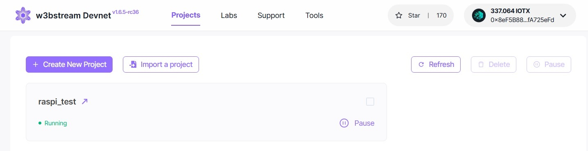
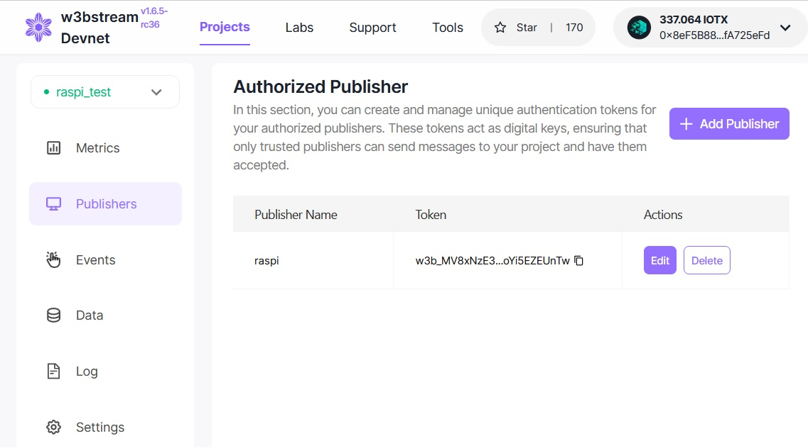
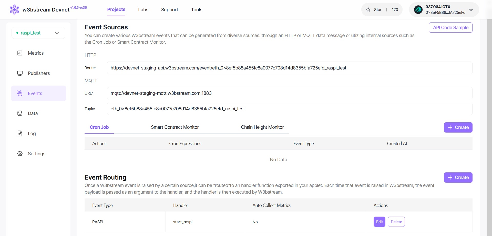

# Installing the Drivers

First, flash a fresh Raspberry Pi OS legacy version with 32 bits on to your micro-SD card. I used [Raspberry Pi Imager](https://www.raspberrypi.com/software/), make sure to enable ssh in the profile before flashing.

## On the RPi

Plug the micro-SD card in the RPi and note the IP address once it booted into the OS. 

Then connect to it with ssh (I use [Putty](https://www.putty.org/) on my Windows machine) and and upgrade it.

```bash
sudo apt-get update && sudo apt-get -y upgrade
```

Enable SPI, I2C and interfaces and disable Seriel console, when asked say "No" and next "yes". 
```
sudo raspi-config
```

Clone the pyCrypto repo
```
git clone https://github.com/Zokrates/pycrypto.git
```

Clone the GPS repo
```
git clone https://github.com/finamon-de/gps-4g-hat-library.git
cd gps-4g-hat-library/
```
Install the virtual environment and the following dependencies.

```
python3 -m venv .venv --system-site-packages
source .venv/bin/activate
python3 -m pip install pynmea2 python-dotenv pyserial gpiod smbus tensorboard_logger

pip uninstall -y gpiod numpy
pip install numpy paho-mqtt bitstring pynmea2 numpy==2.0
sudo apt install -y python3-libgpiod libopenblas-base

```

copy all the files to the gps-4g-hat-library folder.

The newer code of BG77X.py throws errors. Take the 2 year old one.

If you use a UMTS Stick (in my case Huawei E160)
```
sudo apt install -y wvdial
sudo nano /etc/wvdial.conf
```
wvdial.conf configuration for ISP (E-Plus)
```
[Dialer Defaults]
Init1 = ATZ
Init2 = ATQ0 V1 E1 S0=0 &C1 &D2 +FCLASS=0
Modem Type = USB Modem
Baud = 460800
New PPPD = yes
ISDN = 0

[Dialer umtseplus]
Modem = /dev/ttyUSB0
Dial Command = ATD
Carrier Check = no
Phone = *99#
Password = "eplus"
Username = "gprs"
Stupid Mode = 1
Init4 = AT+CGDCONT=1,"IP","internet.eplus.de"
Dial Attempts = 2
```
Connect to internet
```
wvdial -C /home/user/wvdial.conf umtseplus
```


## Get the MQTT Settings from W3bstream

Open https://devnet-staging.w3bstream.com/. Here you login with your IoTex wallet and create a new project and add our wasm and json file.



Add a new publisher and copy the Token.



Now check the events page and copy the Token and Topic.




# On the RPi

Now return to the RPI and enter the copied values (Topic, Token and URL) to the apropriate place in the test code.
