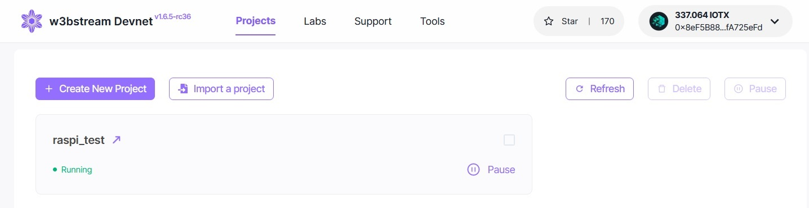
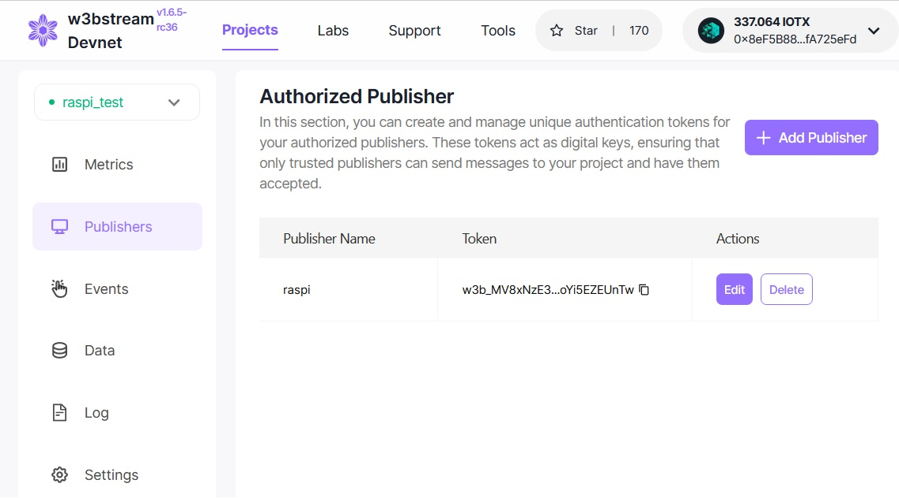
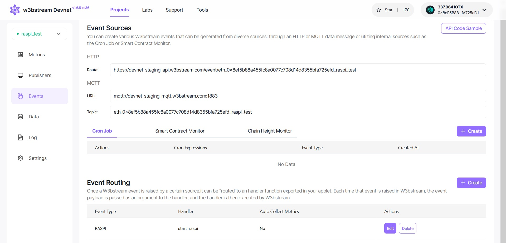
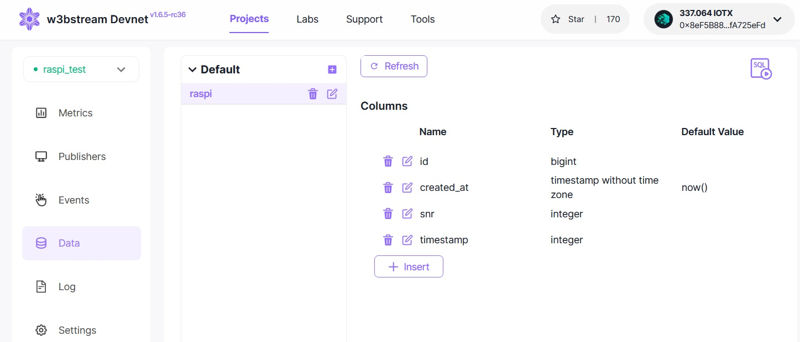

# How to get MQTT working on a Raspberry Pi (RPi)

First, flash a fresh Raspberry Pi OS legacy version with 32 bits on to your micro-SD card. I used [Raspberry Pi Imager](https://www.raspberrypi.com/software/), make sure to enable ssh in the profile before flashing.

## On the RPi

Plug the micro-SD card in the RPi and note the IP address once it booted into the OS. 

Then connect to it with ssh (I use [Putty](https://www.putty.org/) on my Windows machine) and and upgrade it.

```
sudo apt-get update && sudo apt-get -y upgrade
```

Install all the dependencies.

```
sudo apt install -y mosquitto protobuf-compiler python3-protobuf python3-grpc-tools cmake build-essential libmosquitto-dev
```

Clone the Repo.

```
git clone https://github.com/machinefi/web3-iot-sdk.git
```
Go into the repo directory and hard reset it to version 1.0.0. Only this way will the example work on the RPI since the code has been changed since then and is no longer RPI compatible, fixing the compile errors is not worthwhile.

```
cd /web3-iot-sdk
git reset --hard 8997d00ce00334baed710b382997cffe85b9f7c2

```

Install rust.
```
curl --proto '=https' --tlsv1.2 -sSf https://sh.rustup.rs | sh 
```
If necessary logout and run:
```
rustup target add wasm32-wasi 
```
Change to the raspi_test folder and run make.

```
cd web3-iot-sdk/examples/w3bstream-client-rpi-mqtt/tools/wasm/raspi_test/
make
````

## On the w3bstream web interface

Extract the new raspi_test.wasm via and USB stick or SCP from /web3-iot-sdk/examples/w3bstream-client-rpi-mqtt/tools/wasm/raspi_test/target/wasm32-wasi/release and upload it to https://devnet-staging.w3bstream.com/. Here you login with your IoTex wallet and create a new project.



Add a new publisher and copy the Token.



Copy the URL and Topic. Then create a new event.



Add a new database, with snr and timestamp as int32 values.



## On the RPi


Now return to the RPI and enter the copied values (Topic, Token and URL)to the main.cpp.
```
nano web3-iot-sdk/examples/w3bstream-client-rpi-mqtt/main.cpp
```
Return to the web3-iot-sdk folder and compile with the following commands.

```
cmake -DBUILD_EXAMPLE_WEBSTREAM_RPI_MQTT=ON -DGIT_SUBMODULE_UPDATE=ON -S ./ -B ./build-out
```
and 
```
cmake --build build-out --target w3bstream-client-rpi-mqtt
```
change to the folder
cd build-out/examples/w3bstream-client-rpi-mqtt/
and run:
```
./w3bstream-client-rpi-mqtt  -t w3bstream_token  -T w3bstream_topic
```
Running this the first time will generate a private and public key. Convert the public key to decimal format:

```
hexdump -e '16/1 "%02X"' public.key
```
and copy the output to the "raspi_pub_key" variable in the web3-iot-sdk/examples/w3bstream-client-rpi-mqtt/tools/wasm/raspi_test/src/lib.rs file. 

Change to the raspi_test folder and run make.
```
cd web3-iot-sdk/examples/w3bstream-client-rpi-mqtt/tools/wasm/raspi_test/
make
```
## On the w3bstream web interface

upload the raspi_test.wasm file again in the w3bstream devnet settings tab via USB or SCP from /web3-iot-sdk/examples/w3bstream-client-rpi-mqtt/tools/wasm/raspi_test/target/wasm32-wasi/release.

## On the RPI

Return to the compiled app

```
cd web3-iot-sdk/build-out/examples/w3bstream-client-rpi-mqtt/
```

and connect to the MQTT server.
```
./w3bstream-client-rpi-mqtt  -t w3bstream_token  -T w3bstream_topic
```
If you made any changes to the main.cpp again you need to compile again inside the web3-iot-sdk/ folder

```
cmake --build build-out --target example-w3bstream-client-rpi-mqtt
```

Now the MQTT messages should appier in the Web interface.

Source: https://github.com/machinefi/web3-iot-sdk/tree/main/examples/w3bstream-client-rpi-mqtt

## Comments

Note that until now the Secp256k1 signing is applied for signature verification onchain on IoTeX Testnet, not the Baby Jubjub for proof verification in ZoKrates. The GPS values are mocked as well.

This has been tested on a Raspberry Pi 4 Model B Rev 1.4 and a Raspberry Pi 3+ Model B. Chances are high that it works on more models.
